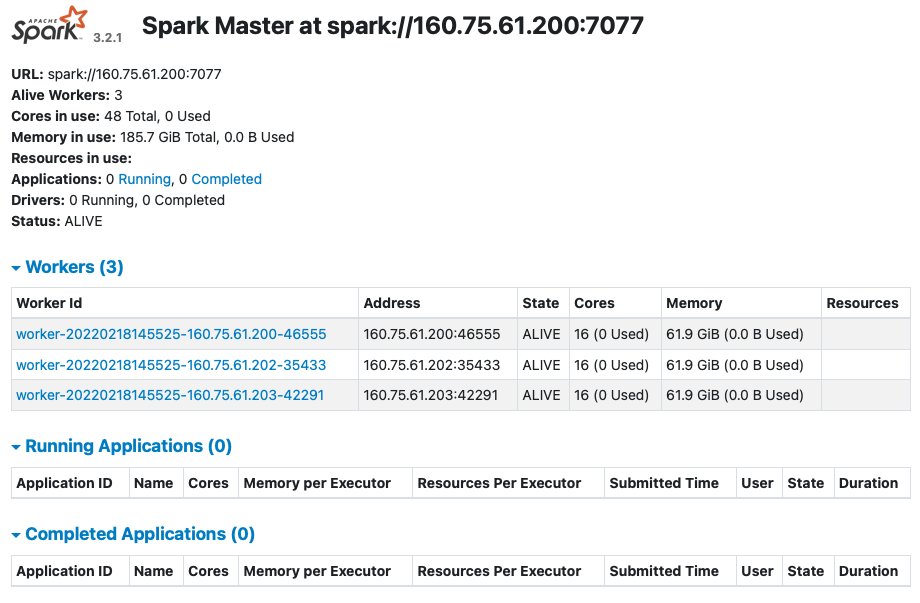

# Spark3 Multinode Cluster Installation on Ubuntu20.04

## Step 1 - Install Java

If java is not installed on your servers, you can install java by following the instructions in;&#x20;

NOTE: We will be using java 8 for this project.&#x20;



## Step 2 - Configure Host Files

You need to configure host names and host files for each node.

* [x] Open the hosts file

```
sudo nano /etc/hosts
```

* [x] Add IP addresses and hostnames of each node in the cluster.

```
160.75.61.200 master
160.75.61.201 slave1
160.75.61.202 slave2
```

## Step 3 - Configure SSH

You need to install open ssh on each node and you need to configure a passwordless ssh connection between nodes.

* [x] Install Open SSH server and client.

```
sudo apt-get install openssh-server openssh-client
```

* [x] Generate Key Pairs on Master

```
ssh-keygen
```

* [x] Copy the content of .ssh/id_rsa.pub(of master) to .ssh/authorized\__keys (of all the slaves as well as master)&#x20;

```
ssh-copy-id user@master
ssh-copy-id user@slave1
ssh-copy-id user@slave2
```

* [x] Test your connection

```
ssh user@slave1
```

## Step 4 - Install Apache Spark

#### We will do these steps on all nodes !!!

* [x] Download Apache Spark

```
wget https://dlcdn.apache.org/spark/spark-3.2.1/spark-3.2.1-bin-hadoop3.2.tgz
```

* [x] Extract the file

```
tar xvf spark-3.2.1-bin-hadoop3.2.tgz
```

* [x] Move the extracted file to the opt directory

```
sudo mv spark-3.2.1-bin-hadoop3.2 /opt/
```

* [x] Open .bashrc file

```
nano ~/.bashrc
```

* [x] Add following lines into .bashrc file

```
export SPARK_HOME=/opt/spark-3.2.1-bin-hadoop3.2 
export PATH=$PATH:$SPARK_HOME/bin:$SPARK_HOME/sbin
export PYSPARK_PYTHON=/usr/bin/python3
```

* [x] Source .bashrc file to apply the changes&#x20;

```
source ~/.bashrc
```


#### We will do the following steps on only Master Node !!!

* [x] Create spark-env.sh file by copying spark-env.sh.template and open this file (ON MASTER)

```
cd /opt/spark-3.2.1-bin-hadoop3.2/conf

cp spark-env.sh.template spark.env.sh

nano spark.env.sh
```

* [x] Add the following lines into spark-env.sh file (ON MASTER)

```
export SPARK_MASTER_HOST='<MASTER-IP>'
export JAVA_HOME= <JAVA_INSTALLATION_PATH>
```

* [x] Add workers (ON MASTER)

```
cd /opt/spark-3.2.1-bin-hadoop3.2/conf

nano slaves
```

* [x] Add following lines (Including host names of the slaves) (ON MASTER)

```
master
slave1
slave2
```

* [x] Run Spark Cluster (ON MASTER)

```
cd /opt/spark-3.2.1-bin-hadoop3.2

./sbin/start-all.sh
```

* [x] Check the status of your cluster over spark UI. Go to your browser and type  http://\<MASTER-IP>:8080/



## Step 5 - Start Spark on Reboot (Additional Step)

You can write a system service to start spark on reboot but to ensure this easly we will use cron job.

* [x] Open cronjob file

```
crontab -e
```

* [x] Add the following line

```
@reboot /opt/spark-3.2.1-bin-hadoop3.2/sbin/start-all.sh
```

## Congratulations :)

Your spark cluster is up and running !!!

